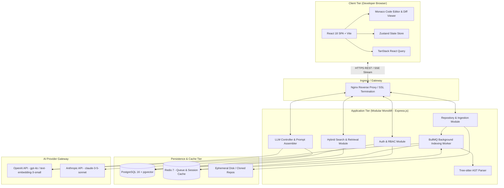
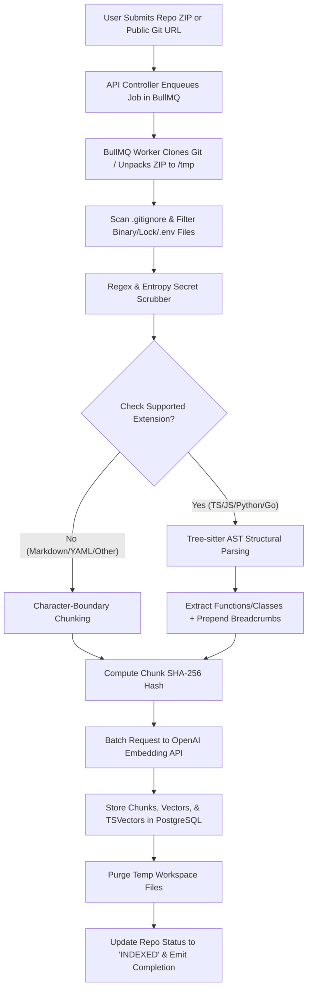
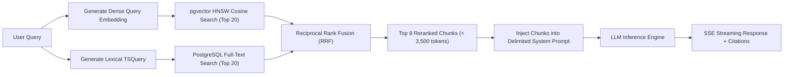
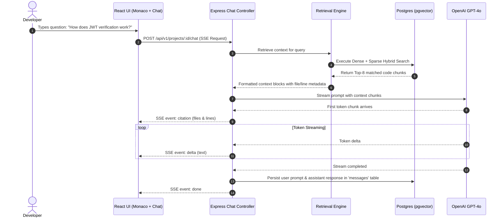
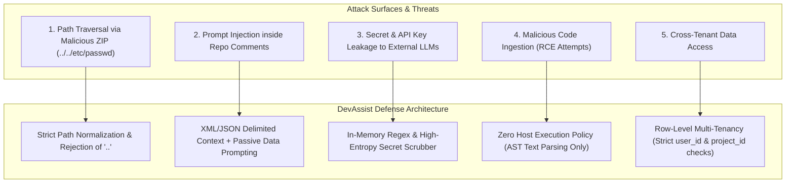

# System Architecture & Diagrams
## Project: DevAssist

---

## 1. High-Level System Architecture



---

## 2. Repository Ingestion & Indexing Pipeline



---

## 3. Hybrid RAG & Query Retrieval Pipeline



---

## 4. Authentication Flow (OAuth2 + Session Cookie)

```mermaid
sequenceDiagram
    autonumber
    actor Dev as Developer
    participant SPA as React Frontend
    participant API as Express API
    participant GH as GitHub OAuth
    participant DB as PostgreSQL

    Dev->>SPA: Click "Sign in with GitHub"
    SPA->>API: GET /api/v1/auth/github
    API->>GH: Redirect to OAuth Consent Page
    GH-->>Dev: Prompt User Consent
    Dev->>GH: Approve Access
    GH->>API: GET /api/v1/auth/github/callback?code=AUTH_CODE
    API->>GH: POST /login/oauth/access_token (Exchange Code)
    GH-->>API: Returns Access Token
    API->>GH: GET /user (Fetch Profile)
    GH-->>API: Returns User Profile (ID, Email, Name)
    API->>DB: Upsert User Profile into 'users' table
    API-->>SPA: Set-Cookie: token=JWT; HttpOnly; Secure; SameSite=Strict
    SPA->>API: GET /api/v1/auth/me (with Cookie)
    API-->>SPA: Return 200 OK + User State
```

---

## 5. End-to-End Chat & Code Citation Sequence



---

## 6. Security Threat Model & Attack Surface


