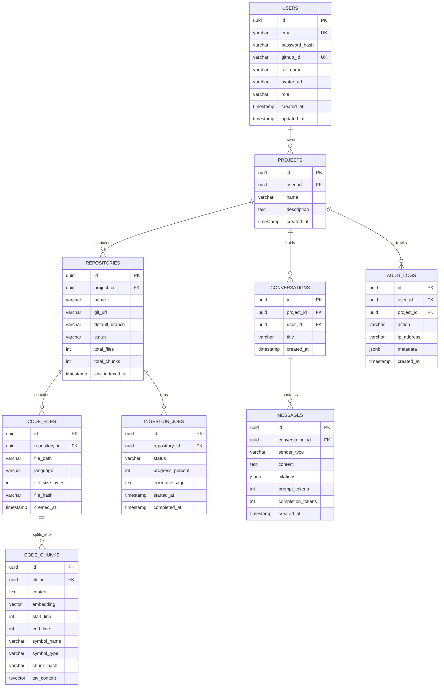

# Database Schema & Data Architecture
## Project: DevAssist

---

## 1. Entity-Relationship Diagram (ERD)



---

## 2. Complete SQL DDL Migration Script

```sql
-- Enable necessary PostgreSQL extensions
CREATE EXTENSION IF NOT EXISTS "uuid-ossp";
CREATE EXTENSION IF NOT EXISTS "vector";

-- 1. Users Table
CREATE TABLE IF NOT EXISTS users (
    id UUID PRIMARY KEY DEFAULT uuid_generate_v4(),
    email VARCHAR(255) NOT NULL UNIQUE,
    password_hash VARCHAR(255),
    github_id VARCHAR(100) UNIQUE,
    full_name VARCHAR(150) NOT NULL,
    avatar_url VARCHAR(500),
    role VARCHAR(50) NOT NULL DEFAULT 'developer',
    created_at TIMESTAMPTZ NOT NULL DEFAULT NOW(),
    updated_at TIMESTAMPTZ NOT NULL DEFAULT NOW()
);

-- 2. Projects Table
CREATE TABLE IF NOT EXISTS projects (
    id UUID PRIMARY KEY DEFAULT uuid_generate_v4(),
    user_id UUID NOT NULL REFERENCES users(id) ON DELETE CASCADE,
    name VARCHAR(100) NOT NULL,
    description TEXT,
    created_at TIMESTAMPTZ NOT NULL DEFAULT NOW()
);
CREATE INDEX IF NOT EXISTS idx_projects_user_id ON projects(user_id);

-- 3. Repositories Table
CREATE TABLE IF NOT EXISTS repositories (
    id UUID PRIMARY KEY DEFAULT uuid_generate_v4(),
    project_id UUID NOT NULL REFERENCES projects(id) ON DELETE CASCADE,
    name VARCHAR(150) NOT NULL,
    git_url VARCHAR(500),
    default_branch VARCHAR(100) DEFAULT 'main',
    status VARCHAR(50) NOT NULL DEFAULT 'PENDING',
    total_files INT NOT NULL DEFAULT 0,
    total_chunks INT NOT NULL DEFAULT 0,
    last_indexed_at TIMESTAMPTZ,
    created_at TIMESTAMPTZ NOT NULL DEFAULT NOW()
);
CREATE INDEX IF NOT EXISTS idx_repositories_project_id ON repositories(project_id);

-- 4. Code Files Table
CREATE TABLE IF NOT EXISTS code_files (
    id UUID PRIMARY KEY DEFAULT uuid_generate_v4(),
    repository_id UUID NOT NULL REFERENCES repositories(id) ON DELETE CASCADE,
    file_path VARCHAR(1000) NOT NULL,
    language VARCHAR(50) NOT NULL,
    file_size_bytes INT NOT NULL,
    file_hash VARCHAR(64) NOT NULL,
    created_at TIMESTAMPTZ NOT NULL DEFAULT NOW()
);
CREATE INDEX IF NOT EXISTS idx_code_files_repo_path ON code_files(repository_id, file_path);

-- 5. Code Chunks Table (with Vector & Full-Text Search)
CREATE TABLE IF NOT EXISTS code_chunks (
    id UUID PRIMARY KEY DEFAULT uuid_generate_v4(),
    file_id UUID NOT NULL REFERENCES code_files(id) ON DELETE CASCADE,
    content TEXT NOT NULL,
    embedding VECTOR(1536) NOT NULL,
    start_line INT NOT NULL,
    end_line INT NOT NULL,
    symbol_name VARCHAR(200),
    symbol_type VARCHAR(50),
    chunk_hash VARCHAR(64) NOT NULL,
    tsv_content TSVECTOR GENERATED ALWAYS AS (to_tsvector('english', content)) STORED
);

-- Indexes for Code Chunks
CREATE INDEX IF NOT EXISTS idx_code_chunks_file_id ON code_chunks(file_id);
CREATE INDEX IF NOT EXISTS idx_code_chunks_embedding ON code_chunks USING hnsw (embedding vector_cosine_ops) WITH (m = 16, ef_construction = 64);
CREATE INDEX IF NOT EXISTS idx_code_chunks_tsv ON code_chunks USING gin (tsv_content);

-- 6. Conversations Table
CREATE TABLE IF NOT EXISTS conversations (
    id UUID PRIMARY KEY DEFAULT uuid_generate_v4(),
    project_id UUID NOT NULL REFERENCES projects(id) ON DELETE CASCADE,
    user_id UUID NOT NULL REFERENCES users(id) ON DELETE CASCADE,
    title VARCHAR(255) NOT NULL DEFAULT 'New Conversation',
    created_at TIMESTAMPTZ NOT NULL DEFAULT NOW()
);
CREATE INDEX IF NOT EXISTS idx_conversations_project ON conversations(project_id);

-- 7. Messages Table
CREATE TABLE IF NOT EXISTS messages (
    id UUID PRIMARY KEY DEFAULT uuid_generate_v4(),
    conversation_id UUID NOT NULL REFERENCES conversations(id) ON DELETE CASCADE,
    sender_type VARCHAR(50) NOT NULL CHECK (sender_type IN ('user', 'assistant', 'system')),
    content TEXT NOT NULL,
    citations JSONB DEFAULT '[]'::jsonb,
    prompt_tokens INT DEFAULT 0,
    completion_tokens INT DEFAULT 0,
    created_at TIMESTAMPTZ NOT NULL DEFAULT NOW()
);
CREATE INDEX IF NOT EXISTS idx_messages_conversation ON messages(conversation_id);

-- 8. Ingestion Jobs Table
CREATE TABLE IF NOT EXISTS ingestion_jobs (
    id UUID PRIMARY KEY DEFAULT uuid_generate_v4(),
    repository_id UUID NOT NULL REFERENCES repositories(id) ON DELETE CASCADE,
    status VARCHAR(50) NOT NULL DEFAULT 'QUEUED',
    progress_percent INT NOT NULL DEFAULT 0,
    error_message TEXT,
    started_at TIMESTAMPTZ,
    completed_at TIMESTAMPTZ,
    created_at TIMESTAMPTZ NOT NULL DEFAULT NOW()
);
CREATE INDEX IF NOT EXISTS idx_ingestion_jobs_repo ON ingestion_jobs(repository_id);

-- 9. Audit Logs Table
CREATE TABLE IF NOT EXISTS audit_logs (
    id UUID PRIMARY KEY DEFAULT uuid_generate_v4(),
    user_id UUID REFERENCES users(id) ON DELETE SET NULL,
    project_id UUID REFERENCES projects(id) ON DELETE CASCADE,
    action VARCHAR(100) NOT NULL,
    ip_address VARCHAR(50),
    metadata JSONB DEFAULT '{}'::jsonb,
    created_at TIMESTAMPTZ NOT NULL DEFAULT NOW()
);
CREATE INDEX IF NOT EXISTS idx_audit_logs_user_proj ON audit_logs(user_id, project_id);
```
