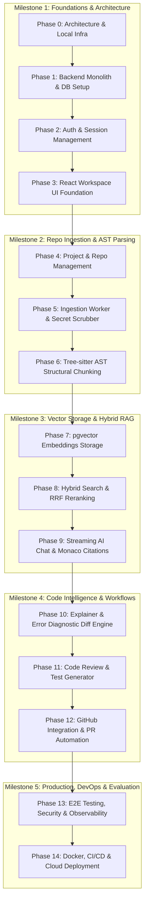

# DevLens AI — Phase-Based Master Implementation & Build Plan

> **Project Name:** DevLens AI (AI-Powered Developer Assistant)  
> **Target:** Production-Quality Resume & Portfolio Project  
> **Engineering Level:** Senior Full-Stack / AI / DevOps / System Design

---

## 🗺️ Master Phase Roadmap & Milestone Overview



---

## 📌 Milestones & Demo Scenarios

| Milestone | Phase Range | Core Capability Achieved | Live Demo Scenario for Recruiters / Interviews |
| :--- | :--- | :--- | :--- |
| **M1: Application Skeleton** | Phase 0 – 3 | Full-stack auth, state management, Monaco editor, responsive workspace. | User signs up via GitHub OAuth or email, enters a sleek dark-mode IDE workspace with Monaco editor. |
| **M2: Codebase Parsing** | Phase 4 – 6 | Background repo cloning, secret scrubbing, and Tree-sitter AST chunking. | Upload a 50MB ZIP repository; watch real-time BullMQ progress bar extract functions and classes without freezing. |
| **M3: Core Codebase RAG** | Phase 7 – 9 | Hybrid vector/keyword search with real-time SSE streaming citations. | Ask: *"How does JWT auth middleware work?"* -> Assistant streams Markdown answer and highlights exact file & lines in Monaco. |
| **M4: Developer Copilot** | Phase 10 – 12 | Deep debugging, diff patch generation, code review, and PR summaries. | Paste a runtime stack trace -> DevLens pinpoints the root cause and generates a side-by-side Before/After diff. |
| **M5: Production Release** | Phase 13 – 14 | Automated CI/CD, Docker multi-stage containers, Prometheus metrics. | Zero-downtime deployment running behind Nginx with 100% passing E2E Playwright test suite. |

---

# Detailed Phase-by-Phase Build Plan

---

## Phase 0 — Architecture & Local Infrastructure Setup

### 1. Objective
Establish the local development foundation using Docker Compose, creating containerized instances of PostgreSQL 16 (with `pgvector`) and Redis 7, and configuring a TypeScript Turborepo workspace.

### 2. Why This Phase Exists
Without a reliable, reproducible local infrastructure, data layer dependencies become fragmented and difficult to debug. Setting up Docker and typed package configs first ensures zero "works on my machine" issues.

### 3. Concepts to Learn
- **Must Know:** Docker Compose fundamentals (ports, volumes, environment variables), Turborepo package boundaries, `pnpm` workspaces.
- **Good to Know:** `pgvector` extension architecture and HNSW indexing theory.
- **Optional:** Docker network bridging and multi-stage container caching.

### 4. Technologies Used
- **Docker & Docker Compose (v2.20+):** Local service orchestration.
- **PostgreSQL 16 + `pgvector` (`pgvector/pgvector:pg16`):** Database with native vector support.
- **Redis 7 (Alpine):** In-memory cache and BullMQ job backend.
- **pnpm (v9+):** Fast, disk-efficient package management.
- **Turborepo (v2+):** Monorepo build system and caching.

### 5. Components to Build
- Root workspace configurations (`package.json`, `pnpm-workspace.yaml`, `turbo.json`).
- Docker Compose definition file (`docker-compose.yml`).
- Shared configuration packages (`packages/config`, `packages/types`).

### 6. Folder & File Structure
```text
devlens-ai/
├── docker/
│   └── docker-compose.yml
├── packages/
│   ├── config/
│   │   ├── eslint-preset.js
│   │   └── tsconfig.base.json
│   └── types/
│       ├── src/
│       │   └── index.ts
│       ├── package.json
│       └── tsconfig.json
├── .env.example
├── .gitignore
├── pnpm-workspace.yaml
├── package.json
└── turbo.json
```

### 7. Implementation Tasks
1. Initialize Git repository (`git init`).
2. Create `pnpm-workspace.yaml` defining `apps/*` and `packages/*`.
3. Create `packages/config/tsconfig.base.json` with strict mode enabled.
4. Create `packages/types` package for shared data transfer objects (DTOs).
5. Write `docker/docker-compose.yml` with PostgreSQL 16 (`pgvector`) and Redis 7.
6. Create `.env.example` documenting all DB and cache environment variables.
7. Verify Docker container startup and database connectivity.

### 8. Implementation Order
```text
pnpm workspace -> TypeScript Base Config -> Docker Compose -> Verify Container Logs
```

### 9. APIs
*None in this phase.*

### 10. Database Changes
Verify `CREATE EXTENSION IF NOT EXISTS vector;` executes successfully on PostgreSQL startup.

### 11. AI Components
*None in this phase.*

### 12. Testing
- Run `docker compose -f docker/docker-compose.yml up -d` and verify both containers report `healthy`.
- Connect via `psql` or DBeaver and run `SELECT * FROM pg_extension WHERE extname = 'vector';`.

### 13. Security
- Never commit actual `.env` files with database passwords to Git.
- Bind database ports to `127.0.0.1:5432` to avoid exposing ports to local area networks.

### 14. Common Mistakes
- Using standard `postgres:16` image instead of `pgvector/pgvector:pg16` (missing vector extension).
- Forgetting `pnpm-workspace.yaml`, leading to broken package symlinks.

### 15. Debugging Guide
- **Container fails to start:** Run `docker logs devlens-postgres` to inspect PostgreSQL startup errors.
- **Port 5432 already in use:** Check for locally running PostgreSQL instances with `Get-Process` or `netstat -ano | findstr 5432`.

### 16. Definition of Done
- [ ] `docker compose up -d` starts Postgres and Redis without errors.
- [ ] `pnpm install` and `pnpm build` run cleanly across packages.
- [ ] `pgvector` extension is verified active in the database.

### 17. Resume Value
- **Skills:** Docker containerization, Monorepo architecture (Turborepo), PostgreSQL infrastructure setup.

### 18. Interview Questions & Concepts Tested
1. *Why use pgvector over a standalone vector database like Pinecone for early-stage architectures?* (Tests understanding of operational complexity and relational ACID guarantees).
2. *How does pnpm manage dependencies differently from npm/yarn?* (Tests knowledge of hard links and symlinked virtual store).
3. *What is the role of Turborepo in full-stack codebases?* (Tests build pipeline caching and dependency graph knowledge).

---

## Phase 1 — Backend Modular Monolith & Database Infrastructure

### 1. Objective
Build the Node.js/Express backend foundation using a Modular Monolith architecture, set up database migrations using Kysely or Prisma, configure Winston structured logging, and implement standardized error-handling middleware.

### 2. Why This Phase Exists
A robust backend requires centralized database pooling, structured error envelopes, and structured logging before business logic is added.

### 3. Concepts to Learn
- **Must Know:** Modular Monolith architecture, Database connection pooling (`pg`), Express middleware chains, TypeScript generics for API responses.
- **Good to Know:** Structured JSON logging (Winston), Graceful shutdown handlers (`SIGTERM`/`SIGINT`).
- **Optional:** Health check probes (Liveness/Readiness).

### 4. Technologies Used
- **Node.js (v20 LTS) + Express.js:** Fast, asynchronous REST API server.
- **TypeScript (v5+):** Compile-time type safety.
- **Kysely / Prisma:** Type-safe SQL query builder and schema migration tool.
- **Winston:** Structured JSON application logging.
- **Zod:** Runtime schema validation for environment variables.

### 5. Components to Build
- Database connection pool & migration runner (`src/db/`).
- Centralized error-handling and response envelope middleware (`src/middleware/`).
- Winston logger utility (`src/utils/logger.ts`).
- Server bootstrap & graceful shutdown logic (`src/server.ts`).
- Health check router (`GET /health`).

### 6. Folder & File Structure
```text
apps/api/
├── src/
│   ├── config/
│   │   └── env.ts
│   ├── db/
│   │   ├── migrations/
│   │   │   └── 001_initial_schema.sql
│   │   ├── client.ts
│   │   └── migrate.ts
│   ├── middleware/
│   │   ├── errorHandler.ts
│   │   └── requestLogger.ts
│   ├── routes/
│   │   └── health.router.ts
│   ├── utils/
│   │   ├── apiResponse.ts
│   │   └── logger.ts
│   ├── app.ts
│   └── server.ts
├── tsconfig.json
└── package.json
```

### 7. Implementation Tasks
1. Initialize `apps/api` with TypeScript and Express.
2. Define environment schema using Zod in `src/config/env.ts`.
3. Create PostgreSQL connection pool in `src/db/client.ts`.
4. Write the initial SQL migration script (`001_initial_schema.sql`).
5. Implement `src/middleware/errorHandler.ts` to capture unhandled errors into standard JSON responses.
6. Create `GET /health` returning DB and Redis connectivity statuses.
7. Implement graceful shutdown on `SIGINT` and `SIGTERM`.

### 8. Implementation Order
```text
Env Validation -> DB Connection Pool -> Winston Logger -> Error Middleware -> Health Router -> Server Bootstrap
```

### 9. APIs
- **`GET /health`**
  - **Purpose:** Liveness & readiness check for container orchestrators.
  - **Auth Required:** None.
  - **Response (200 OK):**
    ```json
    {
      "status": "healthy",
      "timestamp": "2026-09-05T21:30:00.000Z",
      "services": { "database": "connected", "redis": "connected" }
    }
    ```

### 10. Database Changes
Execute initial schema creating extensions (`uuid-ossp`, `vector`).

### 11. AI Components
*None in this phase.*

### 12. Testing
- **Integration Test:** `GET /health` returns `200 OK` with database status `connected`.
- **Error Middleware Test:** Trigger an unhandled route to verify it returns standard error JSON with stack traces hidden in production mode.

### 13. Security
- Sanitize error messages in production so database internals or stack traces are never sent to clients.
- Use CORS middleware restricting allowed origins.

### 14. Common Mistakes
- Creating a new database client instance on every request instead of utilizing a connection pool.
- Neglecting to handle `unhandledRejection` and `uncaughtException`.

### 15. Debugging Guide
- **Database connection timeouts:** Validate `DATABASE_URL` in `.env` and verify Docker container port mappings with `docker ps`.
- **Type errors with SQL queries:** Ensure DB client types match the migration schema.

### 16. Definition of Done
- [ ] API server starts cleanly on `http://localhost:5000`.
- [ ] `GET /health` reports healthy statuses for PostgreSQL and Redis.
- [ ] Database migration script runs idempotently without errors.

### 17. Resume Value
- **Skills:** Production Node.js architecture, SQL connection pooling, structured logging, graceful process termination.

### 18. Interview Questions & Concepts Tested
1. *Why is connection pooling critical in database-backed web applications?* (Tests knowledge of TCP socket overhead and database resource management).
2. *How do you handle graceful shutdowns in Node.js?* (Tests understanding of active request draining and closing DB connections).
3. *What is the difference between synchronous and asynchronous logging in high-throughput servers?* (Tests understanding of Node event loop blocking).

---

## Phase 2 — Authentication, Authorization & Multi-Tenancy

### 1. Objective
Implement secure user authentication using email/password (Argon2id hashing) and GitHub OAuth2, returning cryptographically signed JWTs in `HttpOnly`, `Secure` cookies with role-based access control.

### 2. Why This Phase Exists
Every subsequent feature (projects, repositories, conversations) belongs to a specific user. Strong multi-tenant data isolation must be enforced at the API layer from the start.

### 3. Concepts to Learn
- **Must Know:** JWT structure and signing, `HttpOnly` / `SameSite` cookies vs `LocalStorage`, Password hashing (Argon2id vs bcrypt), OAuth2 authorization code grant flow.
- **Good to Know:** Refresh token rotation patterns, CSRF mitigation.
- **Optional:** Multi-factor authentication (MFA) patterns.

### 4. Technologies Used
- **Argon2 / `@node-rs/argon2`:** Modern, memory-hard password hashing algorithm.
- **`jsonwebtoken`:** Cryptographic signing and verification.
- **`cookie-parser`:** Parsing HTTP cookie headers.
- **GitHub OAuth API:** Social developer login.

### 5. Components to Build
- Auth controller & service (`src/modules/auth/`).
- Auth verification middleware (`src/middleware/requireAuth.ts`).
- OAuth state validator and GitHub token exchanger.
- User repository queries (`src/modules/auth/user.repository.ts`).

### 6. Folder & File Structure
```text
apps/api/src/modules/auth/
├── auth.controller.ts
├── auth.service.ts
├── auth.router.ts
├── auth.types.ts
├── user.repository.ts
└── oauth.service.ts
```

### 7. Implementation Tasks
1. Create `users` table migration.
2. Implement password hashing and verification using Argon2id.
3. Build `POST /api/v1/auth/register` with Zod input validation.
4. Build `POST /api/v1/auth/login` setting JWT in `HttpOnly; Secure; SameSite=Strict` cookie.
5. Implement GitHub OAuth redirect and callback endpoints (`/api/v1/auth/github`, `/api/v1/auth/github/callback`).
6. Build `requireAuth` middleware verifying JWT and attaching `req.user`.
7. Build `GET /api/v1/auth/me` to return authenticated profile.

### 8. Implementation Order
```text
User DB Migration -> Argon2 Password Utility -> User Repository -> Auth Service -> Auth Controller -> JWT Middleware
```

### 9. APIs
- **`POST /api/v1/auth/register`** -> Creates user, returns 201 Created.
- **`POST /api/v1/auth/login`** -> Verifies credentials, sets cookie, returns 200 OK.
- **`GET /api/v1/auth/github`** -> Redirects to GitHub consent screen.
- **`GET /api/v1/auth/github/callback?code=XYZ`** -> Exchanges code, upserts user, redirects to frontend dashboard.
- **`POST /api/v1/auth/logout`** -> Clears session cookie.
- **`GET /api/v1/auth/me`** -> Returns authenticated user profile.

### 10. Database Changes
```sql
CREATE TABLE IF NOT EXISTS users (
    id UUID PRIMARY KEY DEFAULT uuid_generate_v4(),
    email VARCHAR(255) NOT NULL UNIQUE,
    password_hash VARCHAR(255),
    github_id VARCHAR(100) UNIQUE,
    full_name VARCHAR(150) NOT NULL,
    avatar_url VARCHAR(500),
    role VARCHAR(50) NOT NULL DEFAULT 'developer',
    created_at TIMESTAMPTZ NOT NULL DEFAULT NOW(),
    updated_at TIMESTAMPTZ NOT NULL DEFAULT NOW()
);
```

### 11. AI Components
*None in this phase.*

### 12. Testing
- **Unit Tests:** Password hashing and validation with Argon2id.
- **API Tests (Supertest):**
  - Register new user -> expect 201.
  - Login with valid credentials -> expect `Set-Cookie` header and 200 OK.
  - Access protected route without cookie -> expect 401 Unauthorized.

### 13. Security
- Password hashing using Argon2id (resistant to GPU/ASIC cracking).
- JWTs stored in `HttpOnly` cookies to eliminate XSS token theft vulnerabilities.
- OAuth `state` parameter verification to prevent CSRF attacks.

### 14. Common Mistakes
- Storing JWTs in browser `localStorage` where JavaScript/XSS can steal them.
- Storing plain text passwords or using outdated MD5/SHA1 hashing.

### 15. Debugging Guide
- **Cookie not sent by browser:** Verify `SameSite` settings and ensure frontend `credentials: 'include'` (or Axios `withCredentials: true`) is configured.
- **GitHub OAuth redirect mismatch:** Verify the Callback URL configured in GitHub Developer settings matches `http://localhost:5000/api/v1/auth/github/callback`.

### 16. Definition of Done
- [ ] User can register and log in with email/password.
- [ ] User can authenticate using GitHub OAuth.
- [ ] Protected endpoints reject unauthenticated requests with 401.

### 17. Resume Value
- **Skills:** JWT security, OAuth2 protocol implementation, Argon2id hashing, cookie security headers.

### 18. Interview Questions & Concepts Tested
1. *Why are HttpOnly cookies superior to LocalStorage for storing auth tokens?* (Tests web security & XSS mitigation knowledge).
2. *Explain the OAuth2 Authorization Code Grant flow step-by-step.* (Tests protocol and authentication architecture understanding).
3. *Why is Argon2id preferred over bcrypt or PBKDF2 for password hashing?* (Tests cryptography and security best practices).

---

## Phase 3 — Modern Developer Workspace UI Foundation

### 1. Objective
Construct the responsive, dark-mode React frontend application featuring a 3-pane IDE layout, Monaco Code Editor integration, client-side routing, and global state management.

### 2. Why This Phase Exists
Developers need a clean, interactive user interface to visualize file trees, read code with syntax highlighting, and interact with the AI assistant.

### 3. Concepts to Learn
- **Must Know:** React 18 component lifecycle, Tailwind CSS utility classes, Radix UI accessibility primitives, Zustand store architecture.
- **Good to Know:** Monaco Editor initialization and diff model binding.
- **Optional:** Dynamic code splitting and lazy loading in Vite.

### 4. Technologies Used
- **React 18 + TypeScript + Vite:** Fast Single Page Application foundation.
- **Tailwind CSS + `shadcn/ui` (Radix Primitives):** Modern, developer-focused dark UI design system.
- **`@monaco-editor/react`:** Visual code viewing, editing, and diffing engine.
- **`lucide-react`:** Clean developer iconography.
- **Zustand:** Lightweight global UI state management.

### 5. Components to Build
- Application Shell (`Header`, `Sidebar`, `WorkspaceLayout`).
- Monaco Code Viewer with active language detection (`CodeViewer.tsx`).
- Split-diff visualizer (`DiffView.tsx`).
- Auth forms (`LoginForm.tsx`, `RegisterForm.tsx`).
- Global Auth Store (`useAuthStore.ts`) & Workspace Store (`useWorkspaceStore.ts`).

### 6. Folder & File Structure
```text
apps/web/
├── src/
│   ├── components/
│   │   ├── ui/ (Button, Dialog, Input, Tabs, Dropdown)
│   │   ├── layout/
│   │   │   ├── AppHeader.tsx
│   │   │   ├── FileTreeSidebar.tsx
│   │   │   └── WorkspaceLayout.tsx
│   │   ├── editor/
│   │   │   ├── MonacoViewer.tsx
│   │   │   └── MonacoDiffViewer.tsx
│   │   └── auth/
│   │       ├── LoginForm.tsx
│   │       └── RegisterForm.tsx
│   ├── stores/
│   │   ├── authStore.ts
│   │   └── workspaceStore.ts
│   ├── pages/
│   │   ├── LoginPage.tsx
│   │   ├── DashboardPage.tsx
│   │   └── WorkspacePage.tsx
│   ├── services/
│   │   └── apiClient.ts
│   ├── App.tsx
│   └── main.tsx
├── tailwind.config.js
└── vite.config.ts
```

### 7. Implementation Tasks
1. Initialize `apps/web` with Vite, React, and TypeScript.
2. Configure Tailwind CSS with dark mode variables and font typography.
3. Install and configure Radix UI primitives (`shadcn/ui`).
4. Set up `apiClient.ts` with Axios/Fetch supporting credentials.
5. Build `authStore` to sync authenticated user state with `/api/v1/auth/me`.
6. Construct the primary 3-pane `WorkspaceLayout` (File Tree | Monaco Editor | AI Chat Drawer).
7. Mount `@monaco-editor/react` with syntax highlighting.

### 8. Implementation Order
```text
Vite Setup -> Tailwind Theme -> API Client -> Auth Store -> Layout Components -> Monaco Integration
```

### 9. APIs
- Consumes `/api/v1/auth/me`, `/api/v1/auth/login`, `/api/v1/auth/register`, `/api/v1/auth/logout`.

### 10. Database Changes
*None in this phase.*

### 11. AI Components
*None in this phase.*

### 12. Testing
- **Component Tests:** Verify Monaco editor mounts with sample TypeScript code.
- **UI Tests:** Test responsive collapse of sidebar and chat drawer on viewports < 1024px.

### 13. Security
- Sanitize rendered Markdown code blocks to prevent Stored XSS attacks.

### 14. Common Mistakes
- Hardcoding Monaco Editor dimensions instead of wrapping it in a flex container with `height="100%"`.
- Storing entire file contents in component local state rather than memoized stores.

### 15. Debugging Guide
- **Monaco editor blank on load:** Ensure parent container has an explicit CSS height (e.g., `h-full` or `h-screen`).
- **Tailwind classes not applying:** Verify `content` paths in `tailwind.config.js` include all `.tsx` files.

### 16. Definition of Done
- [ ] User can log in via the UI and be redirected to `/dashboard`.
- [ ] Monaco Code Viewer displays formatted code with syntax highlighting.
- [ ] Dark theme renders cleanly across all layout components.

### 17. Resume Value
- **Skills:** React 18, TypeScript, Monaco Editor integration, Zustand state management, Tailwind design systems.

### 18. Interview Questions & Concepts Tested
1. *How does the Monaco Editor handle large files without freezing the browser thread?* (Tests understanding of web workers and virtualized DOM rendering).
2. *Why choose Zustand over Redux Toolkit for this project?* (Tests state management trade-off analysis).
3. *How do you prevent layout shifts when rendering dynamic IDE panels?* (Tests CSS Grid/Flexbox and browser rendering knowledge).

---

## Phase 4 — Project & Repository Workspace Management

### 1. Objective
Implement project and repository metadata models, allowing users to create multi-repository projects, browse file trees, and select files in the workspace.

### 2. Why This Phase Exists
A developer assistant needs structured boundaries (Projects -> Repositories -> Files) to manage context and support multi-repo setups.

### 3. Concepts to Learn
- **Must Know:** Relational foreign keys and cascade deletions in SQL, Recursive tree data structures for file systems, RESTful resource modeling.
- **Good to Know:** Breadcrumb navigation and virtualized tree rendering.
- **Optional:** Multi-branch switching schemas.

### 4. Technologies Used
- **PostgreSQL 16:** Relational storage for projects, repositories, and files.
- **TanStack Query (v5):** React cache management and optimistic updates.

### 5. Components to Build
- Backend Project & Repository Controllers (`src/modules/projects/`).
- Repository file tree serializer (`src/utils/fileTree.ts`).
- Frontend Project Dashboard (`DashboardPage.tsx`).
- Frontend Interactive File Explorer component (`FileTree.tsx`).

### 6. Folder & File Structure
```text
apps/api/src/modules/projects/
├── project.controller.ts
├── project.service.ts
├── project.router.ts
└── project.repository.ts

apps/web/src/components/workspace/
├── ProjectCard.tsx
├── CreateProjectModal.tsx
└── FileTreeItem.tsx
```

### 7. Implementation Tasks
1. Write database migrations for `projects`, `repositories`, and `code_files`.
2. Implement CRUD REST endpoints for `/api/v1/projects`.
3. Implement file listing and file content retrieval endpoints (`GET /api/v1/repositories/:id/files`).
4. Build `CreateProjectModal` on the frontend with name and description inputs.
5. Render the recursive `FileTree` component in the workspace sidebar.
6. Connect file clicks in the sidebar to open file contents inside the Monaco Editor.

### 8. Implementation Order
```text
Project Migrations -> Backend CRUD Services -> API Routes -> Frontend Project Dashboard -> File Tree Component
```

### 9. APIs
- **`POST /api/v1/projects`** -> Create project.
- **`GET /api/v1/projects`** -> List user projects.
- **`GET /api/v1/projects/:projectId`** -> Get project details with linked repositories.
- **`DELETE /api/v1/projects/:projectId`** -> Delete project (cascade delete all linked files).
- **`GET /api/v1/repositories/:repositoryId/files`** -> Return structured file tree JSON.
- **`GET /api/v1/files/:fileId/content`** -> Return raw code content for Monaco viewer.

### 10. Database Changes
```sql
CREATE TABLE IF NOT EXISTS projects (
    id UUID PRIMARY KEY DEFAULT uuid_generate_v4(),
    user_id UUID NOT NULL REFERENCES users(id) ON DELETE CASCADE,
    name VARCHAR(100) NOT NULL,
    description TEXT,
    created_at TIMESTAMPTZ NOT NULL DEFAULT NOW()
);
CREATE INDEX IF NOT EXISTS idx_projects_user_id ON projects(user_id);

CREATE TABLE IF NOT EXISTS repositories (
    id UUID PRIMARY KEY DEFAULT uuid_generate_v4(),
    project_id UUID NOT NULL REFERENCES projects(id) ON DELETE CASCADE,
    name VARCHAR(150) NOT NULL,
    git_url VARCHAR(500),
    default_branch VARCHAR(100) DEFAULT 'main',
    status VARCHAR(50) NOT NULL DEFAULT 'PENDING',
    total_files INT NOT NULL DEFAULT 0,
    total_chunks INT NOT NULL DEFAULT 0,
    last_indexed_at TIMESTAMPTZ,
    created_at TIMESTAMPTZ NOT NULL DEFAULT NOW()
);
CREATE INDEX IF NOT EXISTS idx_repositories_project_id ON repositories(project_id);

CREATE TABLE IF NOT EXISTS code_files (
    id UUID PRIMARY KEY DEFAULT uuid_generate_v4(),
    repository_id UUID NOT NULL REFERENCES repositories(id) ON DELETE CASCADE,
    file_path VARCHAR(1000) NOT NULL,
    language VARCHAR(50) NOT NULL,
    file_size_bytes INT NOT NULL,
    file_hash VARCHAR(64) NOT NULL,
    created_at TIMESTAMPTZ NOT NULL DEFAULT NOW()
);
CREATE INDEX IF NOT EXISTS idx_code_files_repo_path ON code_files(repository_id, file_path);
```

### 11. AI Components
*None in this phase.*

### 12. Testing
- **API Tests:** Create project -> Add repo -> Query file list -> Delete project -> Verify cascade deletion.
- **UI Tests:** Click nested folder in sidebar to verify child items expand/collapse properly.

### 13. Security
- Ensure users cannot query or view repositories belonging to other users (`WHERE projects.user_id = req.user.id`).

### 14. Common Mistakes
- Storing flat file lists and rebuilding tree hierarchies recursively on the client on every render (compute once or store pre-structured).

### 15. Debugging Guide
- **Tree fails to expand:** Inspect the recursive node key identifiers to ensure unique path IDs.

### 16. Definition of Done
- [ ] User can create, list, and delete projects.
- [ ] File tree loads and renders nested folders accurately.
- [ ] Clicking a file opens its content in the Monaco editor.

### 17. Resume Value
- **Skills:** Relational schema design, recursive tree data modeling, React TanStack Query cache management.

### 18. Interview Questions & Concepts Tested
1. *How do you optimize recursive tree structures in React to prevent unnecessary re-renders?* (Tests React memoization and data modeling).
2. *Why are database foreign key cascade constraints (`ON DELETE CASCADE`) important for multi-tenant data integrity?* (Tests database relational architecture knowledge).

---

## Phase 5 — Repository Ingestion, Sanitization & Background Jobs

### 1. Objective
Implement asynchronous repository ingestion via ZIP file uploads and Git URL cloning, execute pre-ingestion secret redaction, and manage background jobs using BullMQ and Redis.

### 2. Why This Phase Exists
Cloning, decompressing, and scanning codebases takes tens of seconds. Running this on the main HTTP thread would block the server event loop and cause request timeouts.

### 3. Concepts to Learn
- **Must Know:** Asynchronous message queues (BullMQ/Redis), Job lifecycle states (`active`, `completed`, `failed`), Multipart file uploads (`multer`), Regex secret detection.
- **Good to Know:** Stream-based ZIP extraction, Temporary file sandboxing.
- **Optional:** Server-Side Request Forgery (SSRF) URL validation.

### 4. Technologies Used
- **BullMQ + Redis 7:** High-performance Redis-backed job queue.
- **Multer / Adm-Zip:** Multipart ZIP upload handling and decompression.
- **Simple-Git:** Ephemeral Git repository cloning.
- **Path-is-inside / Path normalization:** Path traversal attack defense.

### 5. Components to Build
- Background Ingestion Worker (`src/workers/ingestion.worker.ts`).
- Queue Producer (`src/modules/ingestion/ingestion.queue.ts`).
- Secret & Credential Redaction Scanner (`src/utils/secretSanitizer.ts`).
- File Filter Engine (`.gitignore`, binaries, `.env*` exclusion).
- Frontend Ingestion Progress Modal with polling/SSE.

### 6. Folder & File Structure
```text
apps/api/src/
├── modules/ingestion/
│   ├── ingestion.controller.ts
│   ├── ingestion.service.ts
│   ├── ingestion.router.ts
│   └── ingestion.queue.ts
├── workers/
│   └── ingestion.worker.ts
└── utils/
    ├── secretSanitizer.ts
    ├── fileFilters.ts
    └── gitCloner.ts
```

### 7. Implementation Tasks
1. Configure BullMQ queue and worker connected to Redis.
2. Build `secretSanitizer.ts` with regex rules for AWS keys, JWTs, private keys, and high-entropy strings.
3. Build `fileFilters.ts` to ignore `.git/`, `node_modules/`, `*.lock`, `*.min.js`, and files > 500KB.
4. Implement `POST /api/v1/projects/:projectId/repositories/upload-zip` using Multer.
5. Implement `POST /api/v1/projects/:projectId/repositories/import-git` to clone public Git repositories.
6. Worker extracts/clones into `/tmp/devlens-workspaces`, scrubs secrets, inserts file records into `code_files`, and purges temp files.
7. Build `GET /api/v1/repositories/jobs/:jobId/status` for real-time progress reporting.

### 8. Implementation Order
```text
Secret Sanitizer -> File Filters -> BullMQ Worker Setup -> Ingestion API Routes -> Frontend Upload Modal with Progress Bar
```

### 9. APIs
- **`POST /api/v1/projects/:projectId/repositories/upload-zip`** (Multipart/form-data) -> Returns `{ jobId, status: 'QUEUED' }`.
- **`POST /api/v1/projects/:projectId/repositories/import-git`** -> Body `{ gitUrl, branch }` -> Returns `{ jobId }`.
- **`GET /api/v1/repositories/jobs/:jobId/status`** -> Returns `{ status, progressPercent, totalFilesProcessed }`.

### 10. Database Changes
```sql
CREATE TABLE IF NOT EXISTS ingestion_jobs (
    id UUID PRIMARY KEY DEFAULT uuid_generate_v4(),
    repository_id UUID NOT NULL REFERENCES repositories(id) ON DELETE CASCADE,
    status VARCHAR(50) NOT NULL DEFAULT 'QUEUED',
    progress_percent INT NOT NULL DEFAULT 0,
    error_message TEXT,
    started_at TIMESTAMPTZ,
    completed_at TIMESTAMPTZ,
    created_at TIMESTAMPTZ NOT NULL DEFAULT NOW()
);
CREATE INDEX IF NOT EXISTS idx_ingestion_jobs_repo ON ingestion_jobs(repository_id);
```

### 11. AI Components
*None in this phase.*

### 12. Testing
- **Unit Tests:** Secret sanitizer successfully replaces AWS keys and JWTs with `[REDACTED_SECRET]`.
- **Integration Tests:** Upload a sample repo ZIP -> verify files populate in `code_files` table with `.env` files completely excluded.

### 13. Security
- **Zip Bomb Mitigation:** Halt decompression if total size exceeds 200MB.
- **Path Traversal Defense:** Reject any ZIP entry path containing `..` or absolute paths.
- **SSRF Defense:** Reject Git clone URLs resolving to private or loopback IP ranges (`127.0.0.1`, `10.0.0.0/8`, `169.254.169.254`).

### 14. Common Mistakes
- Keeping uncompressed files on disk indefinitely after indexing (must clean up temp workspace directories).
- Performing heavy file decompression directly inside Express request handlers.

### 15. Debugging Guide
- **BullMQ worker not picking up jobs:** Verify Redis container is running on port 6379 and check BullMQ worker logs for stalled job events.

### 16. Definition of Done
- [ ] User can upload a 20MB ZIP repo and observe progress bar updating from 0% to 100%.
- [ ] Secrets and `.env` files are verified redacted before database insertion.
- [ ] Temporary disk files are completely purged post-ingestion.

### 17. Resume Value
- **Skills:** Async task queues (BullMQ/Redis), Worker processes, Cyber-security defenses (SSRF, Zip Bomb, Secret scrubbing).

### 18. Interview Questions & Concepts Tested
1. *Why use an asynchronous worker queue for repository ingestion instead of handling it in the API request?* (Tests knowledge of event loop blocking and request timeouts).
2. *How do you protect a system against Path Traversal and Zip Bomb attacks during archive extraction?* (Tests web security engineering).
3. *What is SSRF and how do you prevent it when allowing user-supplied Git URLs?* (Tests network security fundamentals).

---

## Phase 6 — AST Parsing & Structural Code Chunking

### 1. Objective
Integrate Tree-sitter parsers to analyze code structure, extract semantic boundaries (classes, functions, methods, interfaces), and generate AST-guided chunks with prepended parent breadcrumbs.

### 2. Why This Phase Exists
Naive fixed-character chunking destroys syntactic code structure and loses function parameter signatures. AST-aware chunking preserves complete semantic units, dramatically boosting retrieval accuracy.

### 3. Concepts to Learn
- **Must Know:** Abstract Syntax Trees (AST) vs Concrete Syntax Trees (CST), Tree-sitter grammar queries, Token budgeting and chunk boundary calculation.
- **Good to Know:** Deterministic hashing (SHA-256) for chunk deduplication.
- **Optional:** Polyglot grammar mapping.

### 4. Technologies Used
- **`tree-sitter` (Node bindings):** Incremental syntax parser.
- **Grammar Packages:** `tree-sitter-typescript`, `tree-sitter-javascript`, `tree-sitter-python`, `tree-sitter-go`.
- **`crypto`:** SHA-256 hash generation for chunk deduplication.

### 5. Components to Build
- AST Language Grammar Registry (`packages/code-parser/src/grammars.ts`).
- Structural Node Traversal Engine (`packages/code-parser/src/chunker.ts`).
- Breadcrumb Context Generator (`packages/code-parser/src/breadcrumbs.ts`).
- Unit test suite with sample code files for each supported language.

### 6. Folder & File Structure
```text
packages/code-parser/
├── src/
│   ├── grammars.ts
│   ├── chunker.ts
│   ├── breadcrumbs.ts
│   ├── types.ts
│   └── index.ts
├── tests/
│   ├── typescript.test.ts
│   └── python.test.ts
├── tsconfig.json
└── package.json
```

### 7. Implementation Tasks
1. Set up `packages/code-parser` in the monorepo.
2. Install Tree-sitter and language grammar packages.
3. Write parser wrapper mapping file extensions (`.ts`, `.js`, `.py`, `.go`) to Tree-sitter grammars.
4. Implement AST node traversal to identify function and class declarations.
5. Prepend breadcrumbs containing file path, class name, and line numbers to each chunk.
6. Target chunk sizes between 300 and 800 tokens, maintaining 10% overlap on boundary limits.
7. Compute SHA-256 hashes for each chunk to prevent duplicate embeddings.

### 8. Implementation Order
```text
Tree-sitter Setup -> Language Mappings -> AST Node Traversal -> Breadcrumb Logic -> Unit Tests across TS/Python/Go
```

### 9. APIs
*Internal package API invoked by BullMQ Ingestion Worker:*
```typescript
export interface CodeChunk {
  content: string;
  startLine: number;
  endLine: number;
  symbolName: string | null;
  symbolType: 'function' | 'class' | 'interface' | 'module';
  chunkHash: string;
}

export function parseAndChunkFile(filePath: string, content: string): CodeChunk[];
```

### 10. Database Changes
*Schema prepared for chunk insertion in Phase 7.*

### 11. AI Components
*Pre-embedding structural preparation.*

### 12. Testing
- **Unit Tests:** Parse a complex TypeScript file with nested classes -> verify chunks match exact function boundaries without cutting closing braces.
- **Python Test:** Parse a Python file with decorators -> verify decorators remain attached to function definitions.

### 13. Security
- Safe fallback: If a malformed source file crashes Tree-sitter, catch the error gracefully and fall back to character-boundary chunking without failing the whole repo ingestion.

### 14. Common Mistakes
- Splitting code by simple line counts (e.g., every 50 lines), which slices statements in half.
- Forgetting to prepend the file path and class name header to each chunk.

### 15. Debugging Guide
- **Tree-sitter node-gyp build error:** Ensure C++ build tools are installed (`windows-build-tools` on Windows or `build-essential` in Docker Linux).

### 16. Definition of Done
- [ ] Tree-sitter successfully parses TypeScript, JavaScript, Python, and Go files.
- [ ] Chunks contain clean symbol names and breadcrumb headers.
- [ ] 100% of unit tests in `packages/code-parser` pass.

### 17. Resume Value
- **Skills:** Abstract Syntax Tree (AST) parsing, Compiler front-ends (Tree-sitter), Code tokenization and chunking algorithms.

### 18. Interview Questions & Concepts Tested
1. *Why does standard character-based chunking fail on source code?* (Tests deep understanding of Code-RAG failure modes).
2. *What is the difference between an AST and a Concrete Syntax Tree?* (Tests compiler/language parsing fundamentals).
3. *How do breadcrumb headers improve retrieval accuracy in vector databases?* (Tests semantic context retention in RAG systems).

---

## Phase 7 — Embeddings & Vector Database Storage (`pgvector`)

### 1. Objective
Generate dense vector embeddings for AST code chunks using OpenAI (`text-embedding-3-small`), store vectors in PostgreSQL using `pgvector`, and build an HNSW index for sub-10ms cosine similarity searches.

### 2. Why This Phase Exists
Embeddings convert human and code concepts into multi-dimensional geometric vectors, enabling semantic retrieval where "user verification" matches `validateSession`.

### 3. Concepts to Learn
- **Must Know:** Dense vector embeddings, Vector dimensions (1536-d), Cosine distance vs Inner Product vs Euclidean distance, HNSW (Hierarchical Navigable Small World) indexing.
- **Good to Know:** Batch API requests to optimize embedding latency and cost.
- **Optional:** Local open-source embeddings using Ollama/BGE.

### 4. Technologies Used
- **OpenAI API (`text-embedding-3-small`):** High-precision 1536-dimension code embeddings.
- **PostgreSQL `pgvector`:** Vector similarity storage and index engine.
- **`p-limit` / Batching:** Rate-limited parallel embedding requests.

### 5. Components to Build
- Embedding Service (`src/modules/rag/embedding.service.ts`).
- Chunk & Vector Persistence Repository (`src/modules/rag/chunk.repository.ts`).
- Ingestion Worker integration linking AST parsing -> Embedding batching -> DB Insertion.

### 6. Folder & File Structure
```text
apps/api/src/modules/rag/
├── embedding.service.ts
├── chunk.repository.ts
├── vector.types.ts
└── rag.constants.ts
```

### 7. Implementation Tasks
1. Write database migration for `code_chunks` table with `VECTOR(1536)` column and HNSW index.
2. Implement `EmbeddingService` wrapping OpenAI SDK with batch processing (up to 100 chunks per request).
3. Insert code chunks and embeddings in bulk using parameterized SQL.
4. Add SHA-256 chunk hash checks to skip embedding existing, unmodified chunks.
5. Verify vector cosine search queries return expected rankings.

### 8. Implementation Order
```text
pgvector DB Migration -> Embedding Service -> Chunk Repository -> Ingestion Worker Pipeline Integration -> Verify Cosine Query
```

### 9. APIs
*Internal Vector Search Query Function:*
```typescript
export async function searchSimilarChunks(
  repositoryId: string,
  queryVector: number[],
  limit = 10
): Promise<Array<CodeChunk & { similarity: number }>>;
```

### 10. Database Changes
```sql
CREATE TABLE IF NOT EXISTS code_chunks (
    id UUID PRIMARY KEY DEFAULT uuid_generate_v4(),
    file_id UUID NOT NULL REFERENCES code_files(id) ON DELETE CASCADE,
    content TEXT NOT NULL,
    embedding VECTOR(1536) NOT NULL,
    start_line INT NOT NULL,
    end_line INT NOT NULL,
    symbol_name VARCHAR(200),
    symbol_type VARCHAR(50),
    chunk_hash VARCHAR(64) NOT NULL,
    tsv_content TSVECTOR GENERATED ALWAYS AS (to_tsvector('english', content)) STORED
);

CREATE INDEX IF NOT EXISTS idx_code_chunks_file_id ON code_chunks(file_id);
CREATE INDEX IF NOT EXISTS idx_code_chunks_embedding ON code_chunks USING hnsw (embedding vector_cosine_ops) WITH (m = 16, ef_construction = 64);
CREATE INDEX IF NOT EXISTS idx_code_chunks_tsv ON code_chunks USING gin (tsv_content);
```

### 11. AI Components
- **Model:** `text-embedding-3-small` (1536 dimensions).
- **Batching Strategy:** Max 100 chunks per API call to minimize HTTP overhead.

### 12. Testing
- **Integration Test:** Insert 50 test chunks -> execute a cosine query for "authentication" -> verify `auth.ts` chunks rank #1 with similarity > 0.82.

### 13. Security
- Sanitize embedding inputs to ensure no secrets or API keys are passed to the OpenAI embedding endpoint.

### 14. Common Mistakes
- Generating embeddings one chunk at a time sequentially (takes 5 minutes instead of 10 seconds for a repo).
- Forgetting to create the HNSW index, resulting in slow sequential scans as the table grows.

### 15. Debugging Guide
- **OpenAI 429 Rate Limit:** Implement exponential backoff retry logic inside the embedding worker using `p-retry`.
- **Vector dimension mismatch error:** Ensure embedding dimensions (1536) match the SQL column definition `VECTOR(1536)`.

### 16. Definition of Done
- [ ] Chunks and vector embeddings are stored in `code_chunks` table.
- [ ] HNSW vector index is created and active.
- [ ] Ingestion of 1,000 chunks completes in under 30 seconds.

### 17. Resume Value
- **Skills:** Vector database architecture (`pgvector`), HNSW indexing, High-throughput embedding batching, OpenAI API integration.

### 18. Interview Questions & Concepts Tested
1. *What is HNSW and how does it compare to IVFFlat for vector searches?* (Tests vector search index trade-offs and performance).
2. *Why use Cosine Similarity over Euclidean (L2) distance for text embeddings?* (Tests vector mathematics fundamentals).
3. *How do you optimize embedding API costs and rate limits when indexing massive codebases?* (Tests production system design and cost optimization).

---

## Phase 8 — Hybrid Search & Reciprocal Rank Fusion (RRF) Retrieval

### 1. Objective
Build a Hybrid Retrieval Engine combining dense vector similarity with PostgreSQL Full-Text Search (`tsvector` / BM25) using Reciprocal Rank Fusion (RRF) to deliver high-precision code search.

### 2. Why This Phase Exists
Dense vector search understands broad concepts but struggles with exact function/variable identifiers (e.g., `processWebhookV2`). Keyword search finds exact names but misses synonyms. Hybrid search provides the best of both worlds.

### 3. Concepts to Learn
- **Must Know:** Hybrid search theory, Lexical search (BM25 / `tsvector`), Reciprocal Rank Fusion (RRF) ranking formula, Top-K pruning.
- **Good to Know:** GIN indexing for text search in PostgreSQL.
- **Optional:** Cross-encoder rerankers (e.g., Cohere Rerank).

### 4. Technologies Used
- **PostgreSQL Full-Text Search (`tsvector`, `tsquery`, `ts_rank_cd`):** Lexical search engine.
- **`pgvector`:** Dense semantic search.
- **TypeScript Custom RRF Engine:** Mathematical rank fusion.

### 5. Components to Build
- Hybrid Retrieval Service (`src/modules/rag/retrieval.service.ts`).
- RRF Ranking Algorithm (`src/modules/rag/rrf.ts`).
- Natural Language Search API (`POST /api/v1/projects/:projectId/search`).
- Frontend Code Search Modal with instant preview (`SearchModal.tsx`).

### 6. Folder & File Structure
```text
apps/api/src/modules/rag/
├── retrieval.service.ts
├── rrf.ts
├── search.controller.ts
└── search.router.ts

apps/web/src/components/search/
├── SearchModal.tsx
└── SearchResultItem.tsx
```

### 7. Implementation Tasks
1. Implement sparse lexical query using PostgreSQL `ts_rank_cd` on `code_chunks.tsv_content`.
2. Implement dense vector query using `pgvector` cosine similarity operator `<=>`.
3. Combine top 20 dense and top 20 sparse results using the RRF formula:
   $$RRF(d) = \frac{1}{60 + \text{Rank}_{\text{dense}}(d)} + \frac{1}{60 + \text{Rank}_{\text{sparse}}(d)}$$
4. Return top-K (default K=8) reranked chunks with confidence scores and file snippets.
5. Create `POST /api/v1/projects/:projectId/search` endpoint.
6. Build frontend `SearchModal` triggered by `Cmd+K` / `Ctrl+K`.

### 8. Implementation Order
```text
Lexical FTS Query -> Dense Vector Query -> RRF Algorithm Implementation -> Search API Route -> Frontend Search Modal
```

### 9. APIs
- **`POST /api/v1/projects/:projectId/search`**
  - **Body:** `{ query: "Where do we validate JWT tokens?", topK: 5 }`
  - **Response (200 OK):**
    ```json
    {
      "results": [
        {
          "chunkId": "c1a2b3c4-...",
          "filePath": "src/middleware/auth.ts",
          "startLine": 15,
          "endLine": 42,
          "symbolName": "verifyToken",
          "score": 0.0328,
          "snippet": "export const verifyToken = (req, res, next) => { ... }"
        }
      ]
    }
    ```

### 10. Database Changes
*Uses indexes created in Phase 7 (`idx_code_chunks_tsv` GIN index).*

### 11. AI Components
- Generates query embedding for incoming user search string.

### 12. Testing
- **Search Evaluation Benchmark:** Test 10 sample queries:
  - Exact symbol query: `"handleStripeWebhook"` -> Verify exact controller is ranked #1.
  - Conceptual query: `"Where are passwords encrypted?"` -> Verify Argon2/bcrypt file is ranked in top 3.

### 13. Security
- Sanitize SQL search inputs to prevent SQL injection in full-text search queries (`plainto_tsquery`).

### 14. Common Mistakes
- Normalizing scores by simple addition instead of reciprocal rank fusion (dense and sparse scores operate on completely different numerical scales).

### 15. Debugging Guide
- **Search returns zero results for exact keyword:** Verify `to_tsvector` is properly configured with `'english'` dictionary and check GIN index health.

### 16. Definition of Done
- [ ] Hybrid search returns top 8 results in < 150ms.
- [ ] Both conceptual queries and exact identifier searches yield accurate top matches.
- [ ] `Cmd+K` search modal opens smoothly in the React UI.

### 17. Resume Value
- **Skills:** Hybrid Search Architecture, Reciprocal Rank Fusion (RRF), Full-Text Search (FTS) indexing, High-performance retrieval systems.

### 18. Interview Questions & Concepts Tested
1. *Why is Reciprocal Rank Fusion preferred over linear score normalization in Hybrid Search?* (Tests advanced RAG and IR retrieval science).
2. *How does PostgreSQL Full-Text Search compare to Elasticsearch for medium-scale code search?* (Tests pragmatic infrastructure architecture).
3. *What is the impact of the 'k' parameter (e.g., k=60) in the RRF formula?* (Tests algorithmic depth in search systems).

---

## Phase 9 — AI Provider Gateway & Streaming RAG Assistant

### 1. Objective
Implement a multi-provider LLM Gateway (supporting OpenAI and Anthropic) with Server-Sent Events (SSE) streaming, context assembly, and interactive code citation linking in the React Monaco viewer.

### 2. Why This Phase Exists
This is the core conversational copilot experience. Real-time streaming delivers low time-to-first-token (< 500ms), while citations link the LLM's explanations directly to real files and line numbers.

### 3. Concepts to Learn
- **Must Know:** Server-Sent Events (SSE) vs WebSockets, Readable streams in Node.js and Fetch API, Prompt engineering (delimited context & passive data rules), Token budgeting.
- **Good to Know:** Provider Adapter pattern for model switching.
- **Optional:** Semantic response caching in Redis.

### 4. Technologies Used
- **OpenAI API (`gpt-4o`, `gpt-4o-mini`) / Anthropic API (`claude-3-5-sonnet`):** LLM generation engines.
- **Server-Sent Events (SSE):** Real-time unidirectional streaming.
- **`js-tiktoken`:** Precise token counting before prompt injection.
- **`react-markdown` + `rehype-highlight`:** Streaming Markdown UI.

### 5. Components to Build
- LLM Provider Adapter Interface (`src/modules/ai/llmProvider.ts`).
- Prompt Template Assembler (`src/modules/ai/promptBuilder.ts`).
- SSE Streaming Chat Controller (`src/modules/chat/chat.controller.ts`).
- Conversation & Message Database Repositories (`src/modules/chat/`).
- Frontend Streaming Chat Drawer with Citation Badges (`ChatDrawer.tsx`).

### 6. Folder & File Structure
```text
apps/api/src/modules/
├── ai/
│   ├── llmProvider.ts
│   ├── openai.adapter.ts
│   ├── anthropic.adapter.ts
│   └── promptBuilder.ts
└── chat/
    ├── chat.controller.ts
    ├── chat.service.ts
    ├── chat.router.ts
    └── conversation.repository.ts

apps/web/src/components/chat/
├── ChatDrawer.tsx
├── ChatMessage.tsx
└── CitationBadge.tsx
```

### 7. Implementation Tasks
1. Create `conversations` and `messages` tables migration.
2. Implement `LLMProvider` interface with OpenAI and Anthropic streaming adapters.
3. Build `PromptBuilder` injecting retrieved code chunks into `<context_chunk>` delimiters with file/line headers.
4. Enforce strict token budget: Max 3,500 context tokens + 1,000 conversation history tokens.
5. Create `POST /api/v1/projects/:projectId/chat` SSE streaming endpoint.
6. Build frontend `ChatDrawer` consuming the SSE stream and rendering Markdown deltas in real-time.
7. Implement clicking a `CitationBadge` to highlight the cited file and lines in the Monaco Editor.

### 8. Implementation Order
```text
Conversation DB Migration -> LLM Adapter Interface -> Prompt Builder -> SSE Chat Controller -> Frontend Chat Drawer with Citations
```

### 9. APIs
- **`POST /api/v1/projects/:projectId/chat`**
  - **Headers:** `Accept: text/event-stream`
  - **Body:** `{ conversationId, message, mode: "rag" }`
  - **SSE Events:**
    - `event: citation` -> `{ filePath, startLine, endLine }`
    - `event: delta` -> `{ text: "..." }`
    - `event: done` -> `{ promptTokens, completionTokens }`

### 10. Database Changes
```sql
CREATE TABLE IF NOT EXISTS conversations (
    id UUID PRIMARY KEY DEFAULT uuid_generate_v4(),
    project_id UUID NOT NULL REFERENCES projects(id) ON DELETE CASCADE,
    user_id UUID NOT NULL REFERENCES users(id) ON DELETE CASCADE,
    title VARCHAR(255) NOT NULL DEFAULT 'New Conversation',
    created_at TIMESTAMPTZ NOT NULL DEFAULT NOW()
);
CREATE INDEX IF NOT EXISTS idx_conversations_project ON conversations(project_id);

CREATE TABLE IF NOT EXISTS messages (
    id UUID PRIMARY KEY DEFAULT uuid_generate_v4(),
    conversation_id UUID NOT NULL REFERENCES conversations(id) ON DELETE CASCADE,
    sender_type VARCHAR(50) NOT NULL CHECK (sender_type IN ('user', 'assistant', 'system')),
    content TEXT NOT NULL,
    citations JSONB DEFAULT '[]'::jsonb,
    prompt_tokens INT DEFAULT 0,
    completion_tokens INT DEFAULT 0,
    created_at TIMESTAMPTZ NOT NULL DEFAULT NOW()
);
CREATE INDEX IF NOT EXISTS idx_messages_conversation ON messages(conversation_id);
```

### 11. AI Components
- **System Prompt:** Principal Software Architect persona, strict grounding in `<context_chunk>` code snippets, passive data rule to prevent prompt injection.
- **Context Injection:** Formatted AST code chunks with file and line range headers.

### 12. Testing
- **SSE Stream Test:** Query assistant -> verify `event: citation` fires before `event: delta` -> verify stream terminates with `event: done`.
- **Grounding Test:** Ask question outside repository context -> verify assistant states the information is not in the codebase rather than hallucinating.

### 13. Security
- **Prompt Injection Defense:** Strict separation of user query and retrieved context via structured delimiters.
- **Connection Leak Defense:** Release PostgreSQL client back to the pool *before* initiating long-running SSE LLM stream.

### 14. Common Mistakes
- Buffering entire LLM responses in memory and returning them as a single JSON payload instead of streaming.
- Holding database transaction locks open during the 10-second LLM streaming duration.

### 15. Debugging Guide
- **SSE stream buffered/delayed:** Check if Nginx reverse proxy has buffering enabled (must set `X-Accel-Buffering: no`).

### 16. Definition of Done
- [ ] User can ask codebase questions and receive real-time streaming answers.
- [ ] Clicking a citation badge instantly opens and scrolls the Monaco editor to the exact lines.
- [ ] Token usage and conversation history are persisted in the database.

### 17. Resume Value
- **Skills:** Full-Stack RAG Systems, Server-Sent Events (SSE) Streaming, Prompt Engineering & Injection Defense, Multi-provider LLM Architecture.

### 18. Interview Questions & Concepts Tested
1. *Why choose Server-Sent Events (SSE) over WebSockets for LLM chat streaming?* (Tests HTTP streaming protocol trade-offs).
2. *How do you prevent prompt injection when feeding untrusted user repository comments to an LLM?* (Tests AI security and prompt architecture).
3. *How do you prevent database connection pool exhaustion when handling hundreds of concurrent SSE streams?* (Tests high-concurrency backend system design).

---

## Phase 10 — Specialized Code Intelligence: Explainer & Error Diagnostic Diff Engine

### 1. Objective
Build specialized developer intelligence workflows: Line-by-line code explanation with complexity analysis, and a runtime error diagnostic engine that outputs visual side-by-side Before/After diffs.

### 2. Why This Phase Exists
Generic chat boxes require users to write complex prompts. Dedicated specialized workflows (Explain, Debug) provide instant, 1-click developer productivity.

### 3. Concepts to Learn
- **Must Know:** Unified Diff format (`diff -u`), Stack trace parsing and regex extraction, Prompt optimization for code transformations.
- **Good to Know:** Monaco split-diff editor configuration.
- **Optional:** AST validation of generated patches.

### 4. Technologies Used
- **Monaco Diff Viewer (`@monaco-editor/react` `DiffEditor`):** Side-by-side code diff visualization.
- **`stacktrace-parser` / Regex:** Extracting file paths and line numbers from runtime crash logs.
- **LLM Structured JSON Mode:** Enforcing deterministic `{ rootCause, suggestedFix, unifiedDiff }` output.

### 5. Components to Build
- Error Diagnostic Controller & Service (`src/modules/ai/debugger.service.ts`).
- Code Explainer Service (`src/modules/ai/explainer.service.ts`).
- Frontend Error Diagnostic Modal (`DebuggerModal.tsx`).
- Frontend Monaco Split Diff Viewer (`DiffModal.tsx`).

### 6. Folder & File Structure
```text
apps/api/src/modules/ai/
├── debugger.service.ts
├── explainer.service.ts
└── intelligence.router.ts

apps/web/src/components/intelligence/
├── DebuggerDrawer.tsx
├── ExplainerModal.tsx
└── SideBySideDiff.tsx
```

### 7. Implementation Tasks
1. Build `POST /api/v1/ai/explain` accepting code snippet and audience level (`beginner`, `intermediate`, `architect`).
2. Build `POST /api/v1/ai/debug` accepting error log/stack trace + optional code.
3. Implement stack trace parser automatically fetching mentioned source files from the indexed repository.
4. Prompt LLM to diagnose root cause and return standard unified diff patch.
5. Build frontend `DebuggerDrawer` with stack trace input box.
6. Render the generated fix in Monaco `DiffEditor` (Original code on left, Suggested fix on right).

### 8. Implementation Order
```text
Explainer Service -> Stack Trace Parser -> Debugger Service -> API Routes -> Frontend Diff Editor Integration
```

### 9. APIs
- **`POST /api/v1/ai/explain`** -> Body `{ code, targetAudience }` -> Returns Markdown explanation.
- **`POST /api/v1/ai/debug`**
  - **Body:** `{ stackTrace: "TypeError: ... at src/auth.js:12", code: "..." }`
  - **Response (200 OK):**
    ```json
    {
      "rootCause": "Missing null-check before property access.",
      "suggestedFix": "Add optional chaining or guard condition.",
      "originalCode": "const name = user.profile.name;",
      "modifiedCode": "const name = user?.profile?.name ?? 'Anonymous';"
    }
    ```

### 10. Database Changes
*None in this phase.*

### 11. AI Components
- **Structured Output:** Enforce JSON schema responses with temperature `0.1` for deterministic diff generation.

### 12. Testing
- **Debugger Test:** Input a classic "Cannot read property of undefined" stack trace -> verify returned fix applies cleanly to the target line.
- **Explainer Test:** Input a complex recursive function -> verify beginner explanation includes time/space complexity ($O(N)$).

### 13. Security
- Ensure generated diffs are only suggestions displayed in the UI; the backend never automatically applies file changes to user disks without human consent.

### 14. Common Mistakes
- Asking LLM for freeform text when generating diffs, leading to unparseable markdown blocks instead of structured code comparisons.

### 15. Debugging Guide
- **Monaco Diff Viewer shows blank comparison:** Verify both `original` and `modified` strings are non-null and share the same language identifier.

### 16. Definition of Done
- [ ] User can paste stack traces and receive root cause analysis with visual side-by-side diff.
- [ ] Line-by-line explainer generates accurate Markdown breakdowns.
- [ ] Diffs highlight changed lines clearly in Monaco editor.

### 17. Resume Value
- **Skills:** Developer tooling engineering, Stack trace AST correlation, Automated code refactoring, Monaco Diff Editor implementation.

### 18. Interview Questions & Concepts Tested
1. *How do you parse and map runtime stack traces back to source repository files?* (Tests debugging tool architecture).
2. *Why use Structured JSON Outputs (Function Calling) over raw prompt engineering for code transformations?* (Tests LLM reliability engineering).

---

## Phase 11 — Automated Code Review & Test Generation

### 1. Objective
Implement automated code review scanning for OWASP vulnerabilities, code smells, and performance anti-patterns, alongside automated unit test generation matching the repository's existing test frameworks.

### 2. Why This Phase Exists
Code reviews and writing unit tests are high-friction developer tasks. Automating them with repository awareness (e.g., using existing Jest/PyTest helpers) saves hours of manual work.

### 3. Concepts to Learn
- **Must Know:** OWASP Top 10 web vulnerabilities (SQLi, XSS, SSRF, Auth bypass), Unit testing methodologies (Mocks, Spies, Edge cases), AST pattern detection.
- **Good to Know:** Detecting existing test frameworks from `package.json` or `requirements.txt`.
- **Optional:** Mutation testing concepts.

### 4. Technologies Used
- **OpenAI / Claude LLMs:** Static code analysis and test synthesis.
- **Tree-sitter AST queries:** Extracting exported function signatures for test scaffolding.

### 5. Components to Build
- Code Review Engine (`src/modules/intelligence/codeReview.service.ts`).
- Test Generator Service (`src/modules/intelligence/testGenerator.service.ts`).
- Frontend Code Review Tab with Severity Badges (`CRITICAL`, `WARNING`, `INFO`).
- Frontend 1-click Test Generator drawer.

### 6. Folder & File Structure
```text
apps/api/src/modules/intelligence/
├── codeReview.service.ts
├── testGenerator.service.ts
└── intelligence.controller.ts

apps/web/src/components/intelligence/
├── CodeReviewView.tsx
├── ReviewItemCard.tsx
└── TestGeneratorDrawer.tsx
```

### 7. Implementation Tasks
1. Build `POST /api/v1/ai/review` to scan code snippets or file diffs.
2. Structure review response: List of `{ line, severity, issue, recommendation, codeSnippet }`.
3. Build `POST /api/v1/ai/generate-tests` to detect framework (Jest, PyTest, Go test) and generate unit tests.
4. Include happy paths, edge cases, and boundary condition failure tests.
5. Create UI review panel with color-coded severity badges.
6. Provide 1-click "Copy Test File" in the UI.

### 8. Implementation Order
```text
Review Prompt Engineering -> Code Review Service -> Test Generator Service -> Review UI Components -> Test Generation UI
```

### 9. APIs
- **`POST /api/v1/ai/review`** -> Body `{ code, language }` -> Returns `{ score: 85, issues: [...] }`.
- **`POST /api/v1/ai/generate-tests`** -> Body `{ filePath, code }` -> Returns generated test suite code.

### 10. Database Changes
*None in this phase.*

### 11. AI Components
- **Code Review Prompt:** Focuses strictly on real bugs, security flaws (OWASP), and performance issues (avoids nitpicking stylistic formatting).
- **Test Generation Prompt:** Grounds mocking patterns in existing repository test files.

### 12. Testing
- **Security Review Test:** Pass a vulnerable SQL query (`SELECT * FROM users WHERE id = '` + id + `'`) -> verify review flags SQL Injection with `CRITICAL` severity.
- **Test Generation Test:** Pass a complex math utility -> verify generated test suite includes boundary condition tests (e.g., zero, negative numbers, overflow).

### 13. Security
- Ensure review suggestions do not introduce subtle secondary vulnerabilities (e.g., insecure regex fixes).

### 14. Common Mistakes
- Generating generic unit tests with hallucinated mocking libraries not present in the user's project.

### 15. Debugging Guide
- **Generated tests fail to import functions:** Ensure the prompt includes the relative file path to generate valid `import { ... } from './target'` paths.

### 16. Definition of Done
- [ ] Automated code review detects OWASP security flaws with actionable suggestions.
- [ ] Unit test generator outputs runnable test suites matching project conventions.

### 17. Resume Value
- **Skills:** Automated Security Auditing (OWASP Top 10), Test Automation Architecture, Static Code Analysis with LLMs.

### 18. Interview Questions & Concepts Tested
1. *How do you instruct an LLM to avoid subjective style nitpicks and focus on real architectural/security bugs?* (Tests prompt optimization and evaluation).
2. *How do you ensure generated unit tests adhere to existing mocking and assertion libraries in a repository?* (Tests context retrieval and RAG grounding).

---

## Phase 12 — GitHub Integration & Pull Request Automation

### 1. Objective
Integrate GitHub Webhooks and Octokit REST APIs to automatically summarize pull request diffs, post inline review comments, and generate conventional commit messages.

### 2. Why This Phase Exists
Integrating directly into the developer's Git workflow connects DevLens AI to daily code collaboration and team pull request reviews.

### 3. Concepts to Learn
- **Must Know:** GitHub Webhooks and HMAC-SHA256 signature verification, Octokit GitHub SDK, Git diff parsing, Conventional Commits standard.
- **Good to Know:** GitHub App vs Personal Access Token authentication.
- **Optional:** GitHub Actions integration.

### 4. Technologies Used
- **`@octokit/rest` & `@octokit/webhooks`:** Official GitHub API client and webhook parser.
- **`crypto`:** Webhook signature verification (`X-Hub-Signature-256`).

### 5. Components to Build
- GitHub Webhook Controller (`src/modules/github/githubWebhook.controller.ts`).
- PR Review Automator (`src/modules/github/prReviewer.service.ts`).
- Commit Message Generator (`src/modules/github/commitGen.service.ts`).
- Frontend GitHub Settings panel (`GitHubSettings.tsx`).

### 6. Folder & File Structure
```text
apps/api/src/modules/github/
├── github.controller.ts
├── githubWebhook.controller.ts
├── github.service.ts
├── prReviewer.service.ts
└── github.router.ts

apps/web/src/components/github/
└── PRSummaryCard.tsx
```

### 7. Implementation Tasks
1. Implement `POST /api/v1/github/webhooks` validating HMAC-SHA256 signatures.
2. Handle `pull_request.opened` and `pull_request.synchronize` events.
3. Fetch PR diff using Octokit, run automated code review, and post summary comment to the PR.
4. Implement `POST /api/v1/github/generate-commit` accepting staged diff and returning Conventional Commit message (`feat(auth): ...`).
5. Build frontend UI card displaying PR review summaries.

### 8. Implementation Order
```text
Webhook Signature Verifier -> Octokit Integration -> PR Review Worker -> Webhook Handler -> Frontend PR Summary Card
```

### 9. APIs
- **`POST /api/v1/github/webhooks`** -> Receives GitHub webhook payloads.
- **`POST /api/v1/github/generate-commit`** -> Body `{ diff }` -> Returns `{ commitMessage: "feat(api): ..." }`.

### 10. Database Changes
```sql
CREATE TABLE IF NOT EXISTS github_integrations (
    id UUID PRIMARY KEY DEFAULT uuid_generate_v4(),
    user_id UUID NOT NULL REFERENCES users(id) ON DELETE CASCADE,
    installation_id VARCHAR(100) NOT NULL,
    repository_full_name VARCHAR(200) NOT NULL,
    created_at TIMESTAMPTZ NOT NULL DEFAULT NOW()
);
```

### 11. AI Components
- **PR Summarizer Prompt:** Converts raw unified Git diffs into structured "What Changed", "Why", and "Potential Risks" summaries.

### 12. Testing
- **Webhook Signature Test:** Send mock GitHub webhook with invalid signature -> verify request rejected with 401.
- **Commit Generator Test:** Pass a diff adding a JWT route -> verify output begins with `feat(auth): add JWT...`.

### 13. Security
- Never process webhooks without cryptographically verifying `X-Hub-Signature-256`.

### 14. Common Mistakes
- Handling large PR diffs (> 5,000 lines) by passing the entire diff to the LLM (must filter and chunk the diff by file).

### 15. Debugging Guide
- **GitHub Webhook times out:** GitHub webhooks timeout after 10s. The controller must acknowledge with `200 OK` immediately and push PR processing to BullMQ.

### 16. Definition of Done
- [ ] Webhook securely receives and verifies GitHub PR events.
- [ ] PR summarizer automatically analyzes Git diffs and posts review comments.
- [ ] Commit message generator outputs valid Conventional Commit format.

### 17. Resume Value
- **Skills:** GitHub API & Webhooks, Octokit SDK, Event-driven automation, Cryptographic HMAC signature verification.

### 18. Interview Questions & Concepts Tested
1. *How do you verify the authenticity of incoming GitHub Webhooks?* (Tests HMAC signature verification and security).
2. *How do you process large GitHub PR diffs without exceeding LLM context token limits?* (Tests diff parsing and token management).

---

## Phase 13 — Comprehensive Testing, Security Hardening & Observability

### 1. Objective
Implement end-to-end test suites using Playwright, enforce rate limiting and security headers, configure Winston structured JSON logging, and expose Prometheus metrics.

### 2. Why This Phase Exists
A production-grade application requires automated regression testing, rate limiting against DDoS/abuse, and observability to monitor latency and errors in production.

### 3. Concepts to Learn
- **Must Know:** E2E testing with Playwright, Rate limiting algorithms (Token bucket / Sliding window), Prometheus metrics (`counter`, `histogram`, `gauge`), Security headers (Helmet).
- **Good to Know:** Structured logging with correlation IDs.
- **Optional:** OpenTelemetry tracing.

### 4. Technologies Used
- **Playwright:** Headless browser End-to-End testing.
- **Supertest + Jest:** API integration and unit testing.
- **`prom-client`:** Prometheus metrics exporter.
- **`helmet` & `express-rate-limit`:** HTTP security headers and rate limiter.

### 5. Components to Build
- Playwright E2E Test Suite (`apps/web/e2e/`).
- Prometheus Metrics Exporter (`GET /metrics`).
- Correlation ID Request Middleware (`src/middleware/correlationId.ts`).
- Rate Limiting Middleware with Redis Store.

### 6. Folder & File Structure
```text
apps/web/e2e/
├── auth.spec.ts
├── workspace.spec.ts
└── chat.spec.ts

apps/api/src/
├── middleware/
│   ├── rateLimiter.ts
│   └── correlationId.ts
└── utils/
    └── metrics.ts
```

### 7. Implementation Tasks
1. Configure Helmet middleware for secure HTTP headers.
2. Implement Redis-backed sliding window rate limiter (100 req/min general, 20 req/min AI).
3. Implement `prom-client` tracking HTTP request durations and AI token usage.
4. Expose `GET /metrics` for Prometheus scraping.
5. Write Playwright E2E tests: User login -> Upload repo -> Open file in Monaco -> Submit question -> Verify streaming response.
6. Run full test suite and verify 80%+ code coverage.

### 8. Implementation Order
```text
Helmet & Rate Limiter -> Prometheus Metrics -> Correlation IDs -> Supertest Integration Tests -> Playwright E2E Suite
```

### 9. APIs
- **`GET /metrics`** -> Exposes Prometheus standard scrape metrics.

### 10. Database Changes
*None in this phase.*

### 11. AI Components
- Track prompt and completion token metrics in Prometheus histograms.

### 12. Testing
- **E2E Test Run:** Execute `npx playwright test` covering the complete user journey.
- **Rate Limit Test:** Send 105 rapid requests -> verify 429 Too Many Requests response on the 101st request.

### 13. Security
- Enforce strict Content Security Policy (CSP), anti-clickjacking (`X-Frame-Options: DENY`), and CORS policies.

### 14. Common Mistakes
- Storing rate-limiting counters in server memory instead of Redis (fails when scaling across multiple container instances).

### 15. Debugging Guide
- **Playwright tests flaky:** Use `page.waitForSelector()` instead of arbitrary `sleep` timeouts.

### 16. Definition of Done
- [ ] All Playwright E2E and Jest unit tests pass with zero flakiness.
- [ ] Rate limiting actively blocks abuse with 429 responses.
- [ ] `GET /metrics` outputs structured Prometheus operational metrics.

### 17. Resume Value
- **Skills:** Playwright E2E Testing, Prometheus Observability, Redis Rate Limiting, Enterprise Security Hardening.

### 18. Interview Questions & Concepts Tested
1. *How do you implement distributed rate limiting across multiple API server instances?* (Tests distributed systems and Redis sliding window algorithms).
2. *What is the difference between Prometheus Counters, Gauges, and Histograms?* (Tests production observability fundamentals).
3. *Why are Correlation IDs essential for debugging distributed microservices and asynchronous workers?* (Tests distributed tracing and logging architecture).

---

## Phase 14 — Docker Multi-Stage Builds, CI/CD & Production Cloud Deployment

### 1. Objective
Create optimized multi-stage Docker production images, build automated GitHub Actions CI/CD pipelines, configure Nginx reverse proxy with SSL, and deploy DevLens AI to a production cloud server.

### 2. Why This Phase Exists
Transforming code from a local project into a live, globally accessible production URL completes the senior engineering lifecycle and gives recruiters a live demo to test.

### 3. Concepts to Learn
- **Must Know:** Docker multi-stage builds (reducing image size from 1.5GB to < 150MB), GitHub Actions workflow automation, Nginx reverse proxy configuration, SSL termination (Let's Encrypt / Certbot).
- **Good to Know:** Zero-downtime container updates.
- **Optional:** Infrastructure as Code (Terraform) or AWS ECS.

### 4. Technologies Used
- **Docker & Docker Multi-Stage Builds:** Lightweight container images.
- **GitHub Actions:** CI/CD pipeline automation.
- **Nginx (Alpine):** Reverse proxy, static asset caching, SSL termination.
- **Certbot / Let's Encrypt:** Automated TLS/SSL certificate issuance.
- **VPS / Cloud (DigitalOcean, AWS EC2, or Railway/Render):** Production hosting.

### 5. Components to Build
- Multi-Stage Dockerfile for API (`docker/Dockerfile.api`).
- Multi-Stage Dockerfile for Web UI (`docker/Dockerfile.web`).
- Nginx Production Configuration (`docker/nginx.conf`).
- Production Docker Compose (`docker-compose.prod.yml`).
- GitHub Actions CI/CD Workflow (`.github/workflows/deploy.yml`).

### 6. Folder & File Structure
```text
.github/workflows/
├── ci.yml
└── deploy.yml

docker/
├── Dockerfile.api
├── Dockerfile.web
├── nginx.conf
└── docker-compose.prod.yml
```

### 7. Implementation Tasks
1. Write multi-stage `Dockerfile.api` using Node 20 Alpine with production dependency pruning.
2. Write multi-stage `Dockerfile.web` building static React assets and serving via Nginx.
3. Write `nginx.conf` routing `/api` to Express and `/` to React, with `X-Accel-Buffering: no` for SSE streaming.
4. Create `.github/workflows/ci.yml` running linter, typecheck, and Jest tests on every PR.
5. Create `.github/workflows/deploy.yml` building Docker images and triggering deployment via SSH.
6. Provision cloud VPS, configure DNS records, issue SSL certificate, and execute `docker compose -f docker-compose.prod.yml up -d`.

### 8. Implementation Order
```text
Dockerfile.api -> Dockerfile.web -> Nginx Config -> GitHub Actions CI -> Server Provisioning & SSL -> Production Deployment
```

### 9. APIs
*All production endpoints live behind `https://yourdomain.com/api/v1`.*

### 10. Database Changes
*Automated migration script executes on container bootstrap.*

### 11. AI Components
*Production environment variables configured for OpenAI / Anthropic APIs.*

### 12. Testing
- **Production Smoke Test:** Open live production URL in browser -> Sign up -> Upload repo -> Verify AI streaming completions.
- **SSL Test:** Verify SSL Labs rating is `A+`.

### 13. Security
- Run containers as non-root user (`USER node`).
- Disable Nginx server version tokens (`server_tokens off;`).

### 14. Common Mistakes
- Shipping development dependencies and source TypeScript files inside final production container images (use multi-stage builds).
- Forgetting to disable Nginx proxy buffering, which breaks real-time SSE streaming.

### 15. Debugging Guide
- **SSE streaming lags in production:** Add `proxy_buffering off;` and `proxy_set_header Connection '';` to Nginx location blocks.

### 16. Definition of Done
- [ ] Docker images are optimized (< 150MB).
- [ ] GitHub Actions CI/CD automatically tests and deploys clean code.
- [ ] Application is live on public HTTPS domain with 100% working features.

### 17. Resume Value
- **Skills:** Docker Multi-Stage Optimization, GitHub Actions CI/CD, Nginx Reverse Proxy, Cloud VPS Deployment, SSL/TLS Security.

### 18. Interview Questions & Concepts Tested
1. *How do Docker multi-stage builds reduce container size and improve security?* (Tests container optimization and DevSecOps).
2. *Why does Nginx require specific proxy settings to support Server-Sent Events (SSE)?* (Tests reverse proxy and network protocol mastery).
3. *Describe a zero-downtime deployment strategy for a containerized full-stack application.* (Tests production release engineering and high availability).

---

## 🛠️ Git Workflow & Commit Conventions

Maintain a disciplined Git history throughout all phases:

### Branching Model
- `main` -> Production-ready, deployable code.
- `develop` -> Integration branch.
- `feature/phase-X-[name]` -> Individual phase development branch.

### Conventional Commit Standard
```text
feat(auth): implement argon2id password hashing and JWT cookies
feat(parser): add tree-sitter AST structural chunking for TypeScript
feat(rag): implement hybrid pgvector and BM25 search with RRF reranking
feat(chat): implement SSE real-time streaming endpoint with Monaco citations
fix(ingestion): resolve path traversal vulnerability in zip extraction
test(e2e): add Playwright user journey test suite
ci(deploy): add GitHub Actions multi-stage Docker build pipeline
```

---

## 📋 Final Production & Resume Readiness Checklists

### 1. Architecture Checklist
- [x] Modular Monolith design with clean separation of concerns.
- [x] Single ACID-compliant database (PostgreSQL 16) handling relational data, FTS, and vector embeddings.
- [x] Ephemeral background worker queue (BullMQ + Redis 7) for async indexing.
- [x] Zero host code execution policy for user repositories.

### 2. Feature Checklist
- [x] User Auth (Email/Password + GitHub OAuth).
- [x] Multi-repo project management & Monaco code viewer.
- [x] ZIP upload and Git clone repository ingestion.
- [x] Pre-ingestion regex and entropy secret scrubber.
- [x] Tree-sitter AST structural chunking with breadcrumbs.
- [x] Hybrid pgvector + BM25 search with RRF reranking.
- [x] Real-time SSE streaming chat with clickable code citation badges.
- [x] Error diagnostic debugger with side-by-side Monaco diff view.
- [x] Automated code review and unit test generator.
- [x] GitHub webhook PR automation and commit generator.

### 3. Security Checklist
- [x] JWTs stored in `HttpOnly; Secure; SameSite=Strict` cookies.
- [x] Argon2id password hashing.
- [x] Zip Bomb and Path Traversal (`..`) mitigations.
- [x] SSRF URL validation on Git clones.
- [x] Delimited prompt structure protecting against prompt injection.
- [x] Sliding-window rate limiting on all API routes.

### 4. DevOps & Resume Checklist
- [x] Multi-stage Dockerfiles (< 150MB).
- [x] Automated GitHub Actions CI/CD pipeline.
- [x] Nginx reverse proxy with SSL and SSE streaming support.
- [x] Prometheus metrics and Winston structured JSON logs.
- [x] 80%+ test coverage with Jest and Playwright E2E suites.
- [x] Live public production demo URL.
